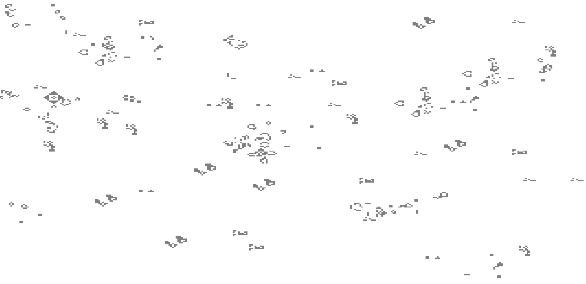

# JDLV


## Project Description
Conway's Game Of Life implementation in JavaScript and HTML Canvas.

Live Demo: https://gol.iskarion.ddns.net/



## Install / Deploy Instructions
 1. Clone Repository
    ```bash
    git clone git@github.com:pinakure/JDLV.git /src/gol
    ```
 2. Get up the container
    ```bash
    cd /src/gol
    docker compose up --build -d
    ```
    